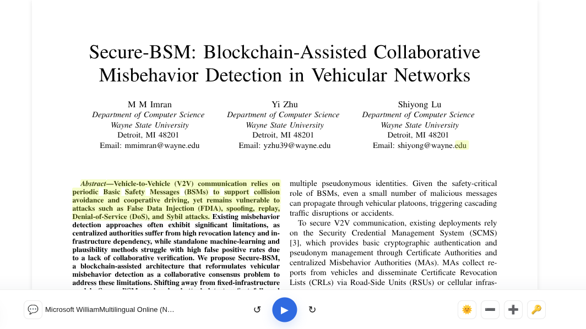

# Document Echo 📄🔊

A PDF reader with text-to-speech capabilities. Upload PDFs, click sentences, and listen with synchronized highlighting.



## ✨ Features

- **📖 PDF Rendering** with zoom controls
- **🎙️ Dual TTS**: OpenAI API (premium) or browser fallback
- **🎯 Interactive Highlighting**: Click any sentence to play
- **💾 Smart Caching**: IndexedDB for instant replay
- **🎨 Dark/Light Theme** with smooth transitions
- **🔊 Voice Selection** from system voices
- **⚡ Prefetching** for seamless playback

## 🚀 Quick Start

```bash
git clone <repository-url>
cd document-echo
npm install
npm run dev
```

Open [http://localhost:3000](http://localhost:3000)

### OpenAI API (Optional)

For premium TTS quality, add your OpenAI API key via the 🔑 icon in the audio bar.

## 🏗️ Tech Stack

- **Next.js 16** - React framework
- **PDF.js** - PDF rendering
- **Zustand** - State management
- **OpenAI API** - Premium TTS
- **IndexedDB** - Client-side caching
- **TypeScript** - Type safety
- **Tailwind CSS** - Styling

## 📖 Usage

1. Upload PDF (drag & drop or browse)
2. Click any sentence to start audio playback
3. Use audio bar controls: ▶ Play/Pause, ↻ Previous, ↺ Next
4. Adjust zoom, theme, and voice settings

## 🛠️ Project Structure

```
├── app/              # Next.js app directory
├── components/       # React components
├── store/           # Zustand state management
├── utils/           # Text processing utilities
└── types.ts         # TypeScript definitions
```

